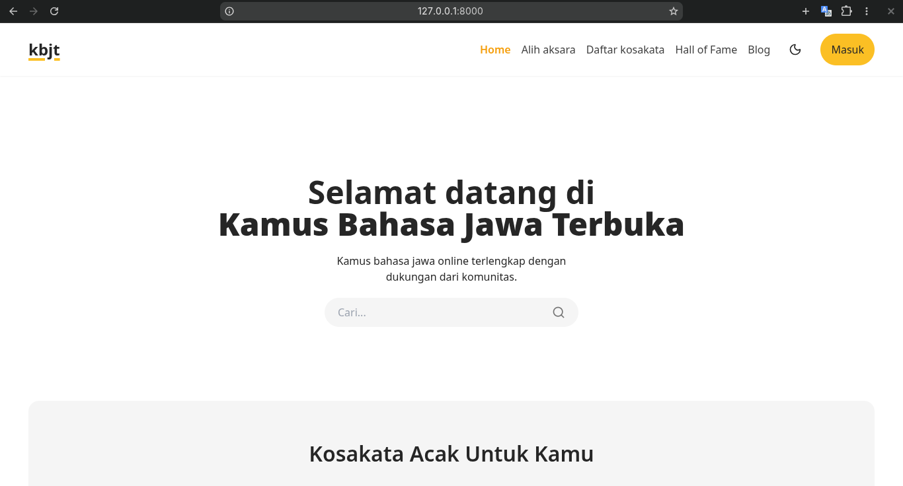
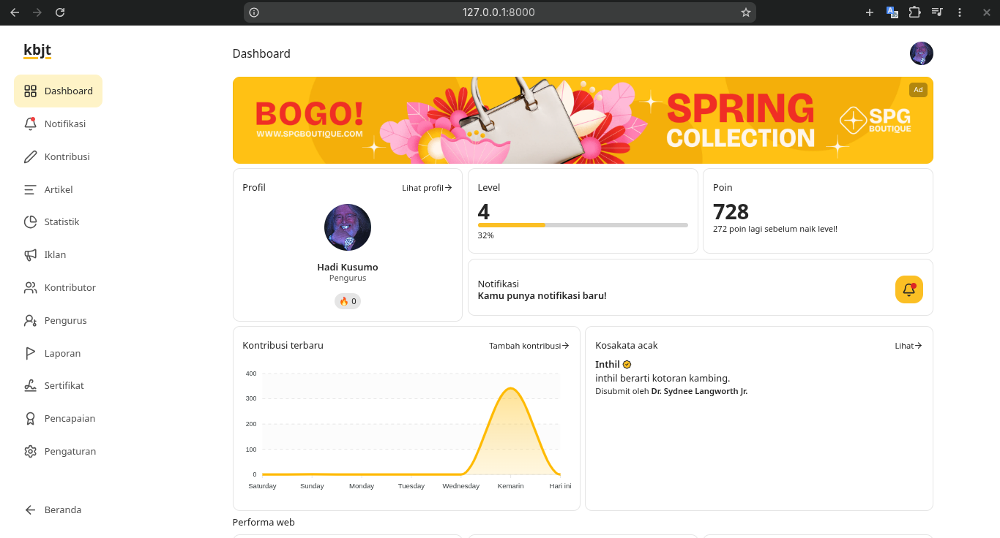
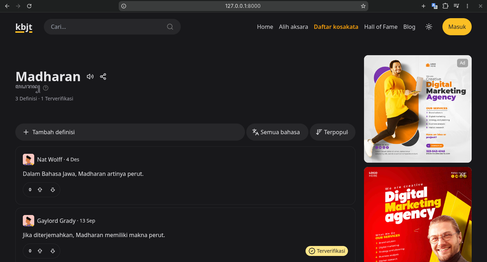
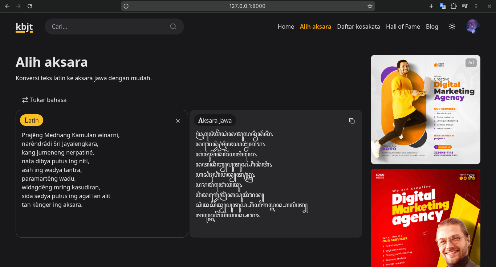

# KBJT: Kamus Bahasa Jawa Terbuka / Open Javanese Dictionary

## 🇬🇧 English

KBJT (Kamus Bahasa Jawa Terbuka) is a web application designed to preserve the Javanese language. It provides an easy and practical platform for the public to document, search, and learn the Javanese language.

This application implements a **crowdsourcing concept** where users can actively contribute to the development of dictionary content. Users can submit vocabulary and definitions without dialect restrictions, and participate in monitoring and validating the accuracy of the information. This results in a dictionary with rich vocabulary data and broad coverage at minimal cost.

### Features
- **Vocabulary Management**: Add, edit, and delete vocabulary and definitions
- **Content Reporting**: Report inappropriate vocabulary and definitions
- **Points & Level System**: Encourage active participation through contribution points and levels
- **Awards**: Achievements, certificates, and a penalty mechanism for content accuracy
- **Web Statistics**: Display application usage statistics powered by [Larapex](https://github.com/ArielMejiaDev/larapex-charts)
- **Blog / Articles**: Share articles related to the Javanese language
- **Notifications**: Simple in-app notification system and via email
- **Latin to Javanese Script Conversion**: Automatically convert Latin text to Javanese script (Aksara Jawa) powered by [CarakanJS](https://github.com/masnormen/carakanjs)
- **Dark Mode**

### Built With
- [Laravel](https://laravel.com/)
- [Livewire](https://livewire.laravel.com/)
- [Tailwind CSS](https://tailwindcss.com/)

## 🇮🇩 Indonesia

KBJT (Kamus Bahasa Jawa Terbuka) adalah aplikasi web yang dirancang untuk melestarikan bahasa Jawa. Aplikasi ini memudahkan masyarakat dalam mendokumentasikan, mencari, dan mempelajari bahasa Jawa secara praktis.

Aplikasi ini menerapkan konsep **crowdsourcing** di mana pengguna dapat berkontribusi aktif dalam pengembangan konten kamus. Pengguna dapat menambahkan kosakata dan definisi tanpa batasan dialek, serta berpartisipasi dalam memantau dan memvalidasi keakuratan informasi yang ada. Hasilnya adalah kamus dengan data kosakata yang kaya dan cakupan yang luas dengan biaya minimal.

### Fitur
- **Manajemen Kosakata**: Tambah, edit, dan hapus kosakata beserta definisinya
- **Pelaporan Konten**: Laporkan kosakata dan definisi yang tidak sesuai
- **Sistem Poin & Level**: Mendorong partisipasi aktif melalui poin dan level kontribusi
- **Penghargaan**: Pencapaian, sertifikat, dan mekanisme sanksi untuk akurasi konten
- **Statistik Web**: Menampilkan statistik penggunaan aplikasi menggunaan [Larapex](https://github.com/ArielMejiaDev/larapex-charts)
- **Blog / Artikel**: Bagikan artikel seputar bahasa Jawa
- **Notifikasi**: Sistem notifikasi sederhana dalam aplikasi dan via email
- **Konversi Aksara Jawa**: Konversi teks Latin ke Aksara Jawa secara otomatis menggunakan [CarakanJS](https://github.com/masnormen/carakanjs)
- **Mode Gelap**

### Dibangun Dengan
- [Laravel](https://laravel.com/)
- [Livewire](https://livewire.laravel.com/)
- [Tailwind CSS](https://tailwindcss.com/)
